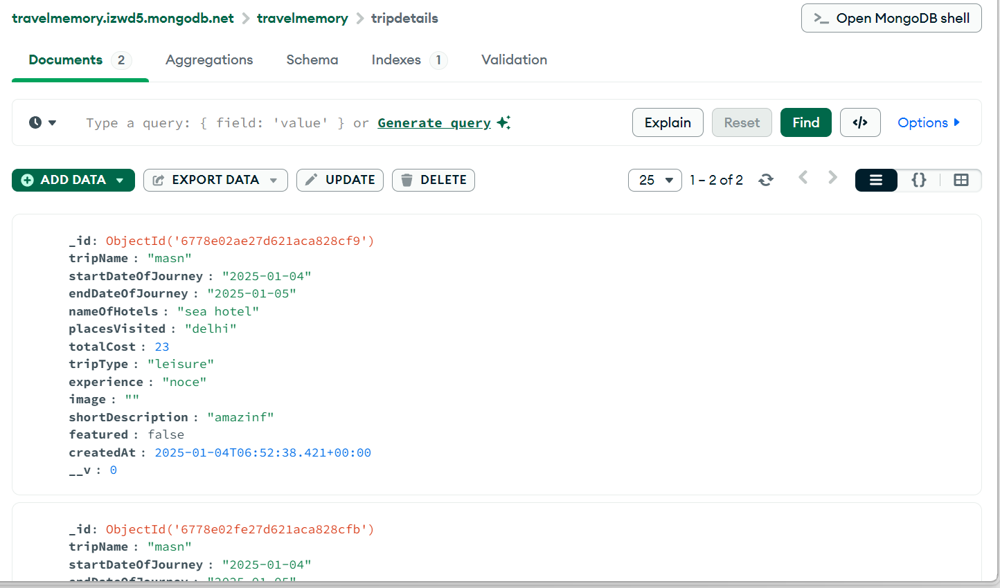
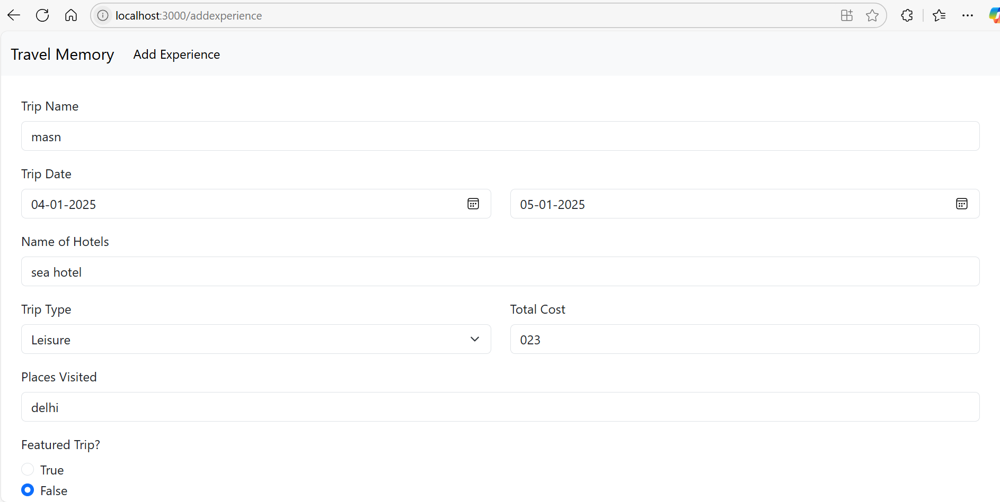
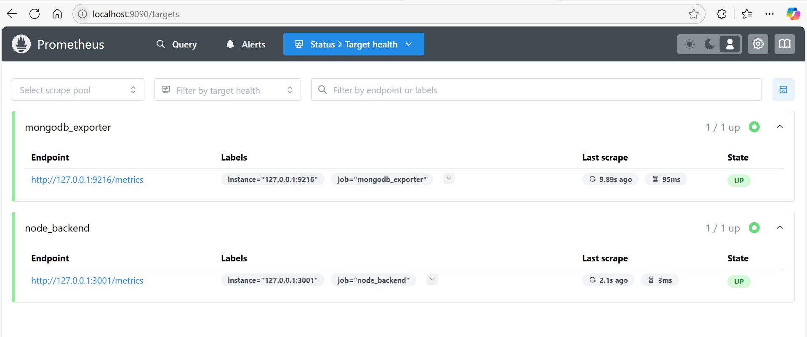
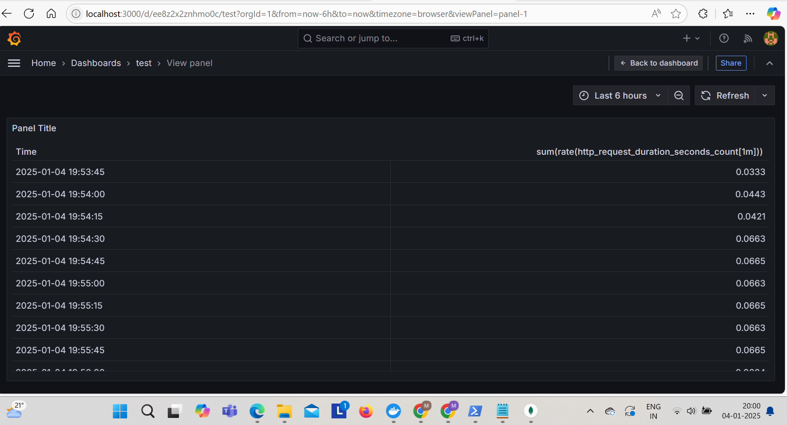
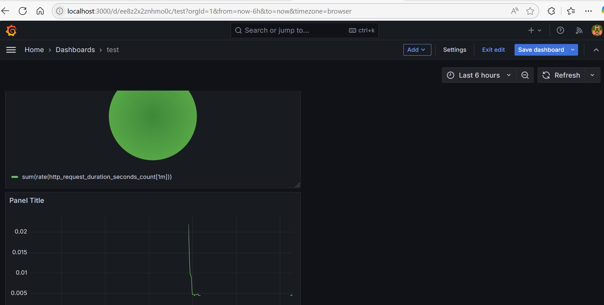

# Advanced Monitoring Solution for MERN Application using Grafana and Prometheus

This project involves setting up a robust monitoring solution for a MERN application. The solution includes performance metrics, log aggregation, distributed tracing, alerting, and advanced visualization using Prometheus, Grafana, and other related tools.

# Introduction

The goal of this project is to create a detailed monitoring setup for a MERN application. This includes tracking backend, frontend, and database performance, log aggregation, distributed tracing, and anomaly detection. The solution uses tools like Prometheus, Grafana, Loki, and Jaeger to achieve full-stack observability and ensure application reliability.

# Prerequisites

Before starting, ensure the following tools are installed:
Node.js: Installed globally for backend and frontend development.
MongoDB: A local or cloud-based MongoDB instance (e.g., MongoDB Atlas).
Docker: To deploy Prometheus, Grafana, Loki, and other services.
Prometheus: For collecting metrics from the application and database.
Grafana: For advanced visualization and monitoring.
Loki and Promtail: For log aggregation and log exploration.
Jaeger: For distributed tracing.

# Steps:
1. MERN Application Setup
Deploy the Travel Memory Application:
Clone the repository:
```
git clone "https://github.com/UnpredictablePrashant/TravelMemory.git"
cd TravelMemory
```
Install dependencies for the backend:
```
cd backend
npm install
```
Install dependencies for the frontend:
```
cd ../frontend
npm install
```
Set up environment variables:

Backend: Create a .env file in the backend folder and configure MongoDB URI and other settings.

Frontend: Update the API endpoint to match the backend's URL.

Start the application:

# Start the backend
```
cd backend
node index.js
```

# Start the frontend
```
cd ../frontend
npm start
```
Verified the application:
Frontend: Visit http://localhost:3000 in browser.
Database: Verify MongoDB data using a MongoDB client or GUI tool.




2. Integrate Prometheus
Backend Metrics
Install Prometheus Node.js Client Library:
```
npm install prom-client
```
Modified Backend to Expose Metrics:

Add a /metrics endpoint in the backend/index.js:
```
const client = require('prom-client');
const collectDefaultMetrics = client.collectDefaultMetrics;
collectDefaultMetrics();

app.get('/metrics', async (req, res) => {
  res.set('Content-Type', client.register.contentType);
  res.end(await client.register.metrics());
});
```
Metrics Exposed:
API response times.
HTTP request counts.
API error rates.

Verified Metrics:
By Accessing http://localhost:3001/metrics.

MongoDB Monitoring
Install MongoDB Exporter:
```
docker pull bitnami/mongodb-exporter:latest
```
Run MongoDB Exporter:
```
docker run -d \
    -p 9216:9216 \
    --name mongodb-exporter \
    --network="host" \
    -e MONGODB_URI="mongodb+srv://<username>:<password>@<cluster-url>/dbname" \
    bitnami/mongodb-exporter:latest
```
Verify Metrics:
By Accessing http://localhost:9216/metrics.

Prometheus Configuration
Update prometheus.yml:
```
scrape_configs:
  - job_name: 'node-backend'
    static_configs:
      - targets: ['172.17.0.1:3001']

  - job_name: 'mongodb'
    static_configs:
      - targets: ['172.17.0.2:9216']
```
Restart Prometheus:
```
docker restart prometheus
```

3. Enhance Grafana Dashboards

Run Grafana in Docker:
```
docker run -d -p 3000:3000 grafana/grafana
```
Add Prometheus as a Data Source:
Navigate to Configuration > Data Sources > Add Data Source.
Select Prometheus.
Set the URL to http://172.17.0.3:9090.
Save and test the data source.

Create Dashboards:
Add panels for:
Backend performance metrics (response times, error rates).
MongoDB metrics (connections, query execution times).
Save the dashboard.



4. Log Aggregation

Install Loki for Log Aggregation:
```
docker run -d -p 3100:3100 --name loki grafana/loki:latest
```
Run Promtail for Log Shipping:
```
docker pull grafana/promtail:latest
```
Configure Promtail:

Create promtail-config.yml:
```
server:
  http_listen_port: 9080
clients:
  - url: http://172.17.0.5:3100/loki/api/v1/push
positions:
  filename: /tmp/positions.yaml
scrape_configs:
  - job_name: system
    static_configs:
      - targets:
          - localhost
        labels:
          job: varlogs
          __path__: /var/log/*.log
```
Run Promtail:
```
docker run -d -v /path/to/promtail-config.yml:/etc/promtail-config.yml grafana/promtail:latest
```
Visualize Logs in Grafana:
Add Loki as a data source.
Create a dashboard with log panels.

5. Implement Distributed Tracing

Run Jaeger:
```
docker run -d --name jaeger -p 16686:16686 jaegertracing/all-in-one:latest
```
Integrate Tracing with Backend:
```
npm install @opentelemetry/api @opentelemetry/sdk-node @opentelemetry/exporter-jaeger
```
Add Tracing Configuration to index.js:

Include the OpenTelemetry setup.

Verify Tracing:

Access Jaeger UI: http://localhost:16686.

Connect Jaeger to Grafana:

Add Jaeger as a data source in Grafana.

6. Alerting and Anomaly Detection

Set Up Alerts in Prometheus:

Defined alert rules for critical metrics.
```
High API latency.
alert: HighLatency
expr: "histogram_quantile(0.95, rate(http_request_duration_seconds_bucket[5m])) > 1"
for: 5m
labels:
  severity: critical
annotations:
  summary: "High API latency detected"
```
Added Notification Channels:
Configure Slack, email, or webhook integrations in Grafana.
Explore Anomaly Detection:
Use machine learning plugins in Grafana for predictions.
